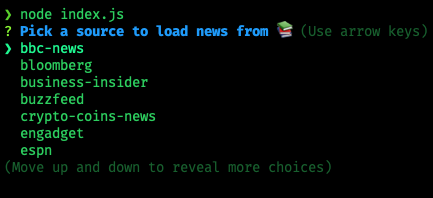
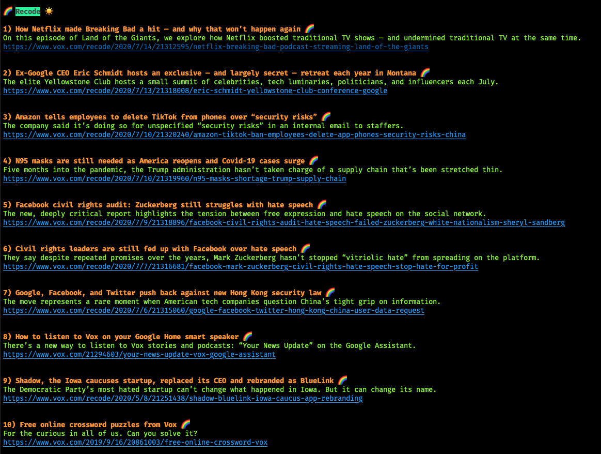

# news-cli 📚
A CLI Tool built using Inquirer that fetches the latest news updates based on source

### Installation 
Navigate to desired directory using the terminal. Enter the following command

```git clone https://github.com/ARitik/news-cli.git```

To run , enter ```node index.js```

### Usage
After running ```node index.js``` , select the option you want to see news from.



The tool will fetch the latest top-ten news from the option you've selected using the news-api.



Also available as an NPM package 

https://www.npmjs.com/package/whatsnews